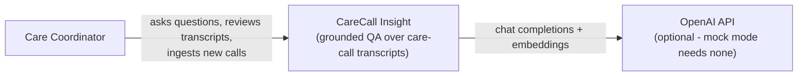
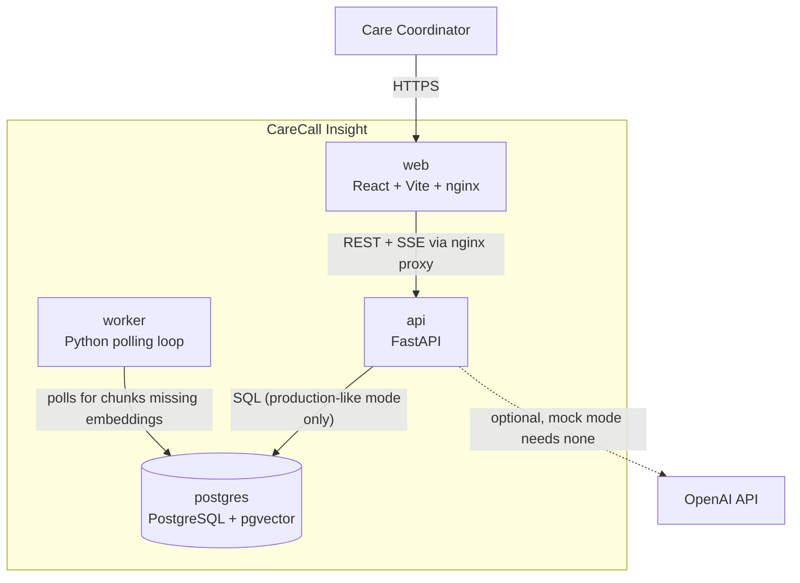
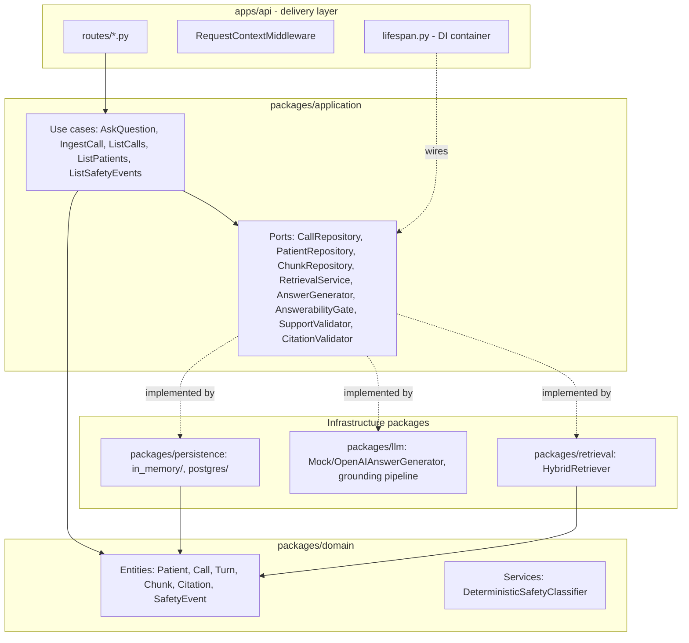
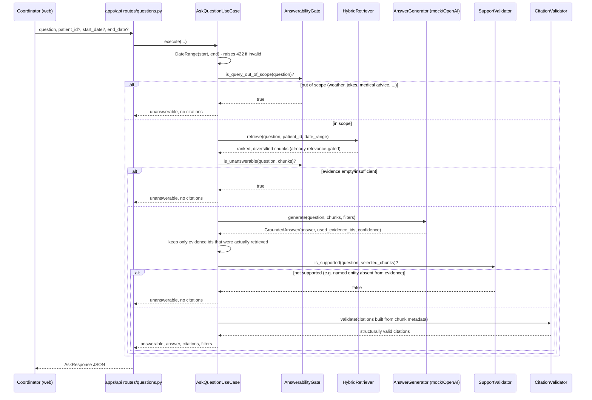
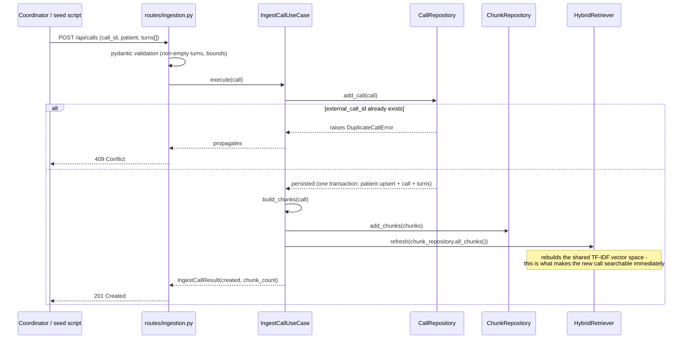

# Architecture

## 1. Why a modular monolith, not microservices

CareCall Insight is one small team's internal tool over a corpus that today is 21 calls and will realistically grow to thousands, not billions. There is no independent scaling requirement between "answer a question" and "ingest a call" that would justify the operational cost of separate deployables, separate databases, or a message bus. A modular monolith gets the benefit that actually matters here - **enforced boundaries** (via ports/interfaces between layers) - without the cost that doesn't apply yet - independent deployment and scaling. See [ADR 0001](docs/adr/0001-modular-monolith.md).

Every package boundary in this repo is already where a future service boundary would go, if one were ever needed: `packages/retrieval` could become a retrieval service, `packages/llm` an answer-generation service, `apps/worker` could scale out independently. Nothing here would need to be re-architected to split later - it would need infrastructure added, not code redesigned.

## 2. System context

## 3. Containers

## 4. Components (API delivery layer -> layers)

## 5. Query data flow (`POST /api/ask`)

## 6. Ingestion data flow (`POST /api/calls`)

## 7. Failure modes

| Failure | Behavior |
|---|---|
| PostgreSQL unreachable (production-like mode) | `/api/readiness` returns 503; `/api/health` still returns 200 if the process itself is up but was already initialized - a fresh boot against a dead DB fails startup loudly instead of silently falling back to memory mode. |
| OpenAI API down/rate-limited/timeout | `OpenAIAnswerGenerator` retries transient errors with exponential backoff, then falls back to the deterministic mock generator - the user gets an answer, never a 500. |
| Worker process not running | Embeddings simply don't get backfilled; retrieval is unaffected (it doesn't use the embedding column - see [docs/architecture/retrieval.md](docs/architecture/retrieval.md)). No user-facing impact. |
| Client disconnects mid-stream (`/api/ask/stream`) | The generator simply stops being iterated; no resources held open server-side beyond the request's own lifetime. |
| Duplicate ingestion (retry, race) | `add_call()` raises `DuplicateCallError` -> HTTP 409 (single) or a per-item `"duplicate"` status (batch) - never a silent double-insert. |
| Malformed ingestion payload (one bad record in a batch) | Reported per-item as `"error"` with the reason; the rest of the batch still processes. |
| Invalid date filter (`start_date` after `end_date`) | 422 with a clear message, before any retrieval call is made. |

## 8. Scaling strategy

- **Read-heavy QA traffic**: the API is stateless per request (all state is the DB or the in-process retrieval index); horizontally scale `api` replicas behind a load balancer. The retrieval index itself is rebuilt in each replica's memory from the shared corpus, so no shared retrieval state is required at this scale.
- **Corpus growth**: PostgreSQL + pgvector scales into the hundreds of thousands of chunks comfortably with a proper `ivfflat`/`hnsw` index (not yet added - the `embedding` column exists but query-time vector search isn't wired in yet, see roadmap). Beyond that, this is exactly the boundary at which `packages/retrieval` could be extracted into its own service with a dedicated vector store, without touching `packages/application`'s ports.
- **Ingestion bursts**: `apps/worker` already exists as the async-work boundary; a bulk-ingestion job queue (a `status` column on `ingestion_jobs`, already in the schema) is the natural next step if ingestion volume grows past what the synchronous endpoint should hold a request open for.
- **LLM cost/latency**: `AnswerGenerator` is swappable per the port; a cheaper/faster/self-hosted model is a new class, not a rewrite.

## 9. Component map for a new developer (10-minute tour)

1. `apps/api/src/carecall_api/main.py` - the whole app in one glance: middleware, routers, exception handling.
2. `apps/api/src/carecall_api/lifespan.py` - the composition root; every concrete implementation gets wired here.
3. `packages/application/src/carecall_application/use_cases/ask_question.py` - the entire grounded QA flow.
4. `packages/retrieval/src/carecall_retrieval/hybrid.py` - the ranking algorithm.
5. `packages/llm/src/carecall_llm/grounding/` - the safety pipeline (query intent, support validation, citation validation).
6. `packages/domain/src/carecall_domain/` - the vocabulary of the whole system (Call, Turn, Chunk, Citation, SafetyEvent) with zero framework imports.
7. `packages/persistence/src/carecall_persistence/{in_memory,postgres}/` - the two storage modes, same ports.
8. `apps/web/src/app/App.tsx` - the frontend composition root.
9. `compose.yaml` - how all five containers fit together.
10. `data/evaluation/` - what "correct" means for this system, in two files.
